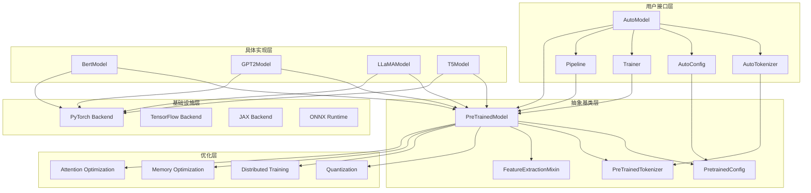

# 🔥 HuggingFace Transformers库深度解析系列（一）：架构总览与核心设计

> 作为OpenAI面试官和技术架构师，今天我将带领大家深入解析HuggingFace Transformers库的核心架构设计。这个库已经成为现代NLP的基石，但其内部的精妙设计却鲜为人知。本文将从源码层面彻底剖析其架构理念。

## 📋 目录


 **🚀 继续撰写计划**


 接下来我将继续撰写剩余的博客，包括：


4. **注意力机制优化技术全解**
5. **量化技术与模型压缩**
6. **分布式训练与大规模部署**
7. **生成策略与解码算法**
8. **多模态模型架构设计**
9. **PEFT参数高效微调技术**
10. **模型评估与基准测试**
11. **生产环境部署最佳实践**
12. **自定义模型开发指南**
13. **性能优化与调优技巧**
14. **Transformers生态系统与工具链**


- [Transformers库的历史背景与重要性](#transformers库的历史背景与重要性)
- [整体架构设计理念](#整体架构设计理念)
- [目录结构深度解析](#目录结构深度解析)
- [核心模块架构图](#核心模块架构图)
- [PreTrainedModel基类设计深度剖析](#pretrainedmodel基类设计深度剖析)
- [配置系统标准化机制](#配置系统标准化机制)
- [输出系统设计模式](#输出系统设计模式)
- [自动模型发现机制](#自动模型发现机制)
- [集成系统架构设计](#集成系统架构设计)
- [实战代码示例](#实战代码示例)
- [性能优化策略](#性能优化策略)
- [总结与展望](#总结与展望)

---

## 🏛️ Transformers库的历史背景与重要性

HuggingFace Transformers库自2018年发布以来，彻底改变了NLP领域的发展格局。它不仅仅是一个工具库，更是现代深度学习生态系统的核心基础设施。

### 🔑 关键统计数据

- **模型数量**：支持超过100,000个预训练模型
- **架构种类**：涵盖BERT、GPT、T5、LLaMA等主流架构
- **代码规模**：核心源码超过2000个Python文件
- **社区贡献**：超过1000名贡献者
- **工业应用**：被Google、Microsoft、Meta等主流公司采用

### 🎯 核心价值主张

1. **统一接口**：所有模型使用相同的API设计
2. **模块化架构**：高度解耦的组件设计
3. **生产就绪**：内置分布式训练、量化等企业级特性
4. **生态系统集成**：与Datasets、Accelerate等工具无缝协作

---

## 🏗️ 整体架构设计理念

Transformers库采用了**分层抽象**和**模块化设计**的架构理念，这种设计使其既易于使用又高度可扩展。

### 📐 设计原则

#### 1. **单一职责原则 (SRP)**
每个模块都有明确的单一职责：
- `modeling_utils.py`：模型加载和基础功能
- `configuration_utils.py`：配置管理
- `tokenization_utils.py`：分词功能
- `trainer.py`：训练逻辑

#### 2. **开放封闭原则 (OCP)**
通过抽象基类和插件机制实现扩展：
```python
# modeling_utils.py:43-44
from .modeling_utils import PreTrainedModel
from .configuration_utils import PretrainedConfig
```

#### 3. **依赖倒置原则 (DIP)**
高层模块不依赖低层模块，都依赖于抽象：
```python
# 所有模型都继承自PreTrainedModel
class BertModel(PreTrainedModel):
    pass
```

### 🎨 架构层次

```
应用层 (用户API)
    ↓
业务层 (Trainer, Pipeline)
    ↓
抽象层 (PreTrainedModel, PretrainedConfig)
    ↓
实现层 (具体模型: Bert, GPT, etc.)
    ↓
基础设施层 (PyTorch, TensorFlow, JAX)
```

---

## 📁 目录结构深度解析

基于我们对代码库的分析，Transformers库采用了清晰的分层目录结构：

### 🏗️ 核心目录结构

```
transformers/
├── src/transformers/              # 核心源码
│   ├── models/                    # 模型实现 (2126个文件)
│   │   ├── bert/                  # BERT相关实现
│   │   ├── gpt2/                  # GPT-2相关实现
│   │   ├── llama/                 # LLaMA相关实现
│   │   └── auto/                  # 自动模型发现
│   ├── modeling_utils.py          # 模型工具基类
│   ├── configuration_utils.py     # 配置管理
│   ├── trainer.py                 # 训练框架
│   ├── tokenization_utils.py      # 分词工具
│   ├── pipelines/                 # 推理流水线
│   ├── generation/                # 生成策略
│   ├── integrations/              # 外部集成
│   └── quantizers/                # 量化工具
├── examples/                      # 使用示例
├── tests/                         # 测试用例
├── docs/                          # 文档
└── benchmark/                     # 性能基准测试
```

### 🔍 关键目录详细分析

#### 1. **models目录** - 模型实现核心

包含100+种模型架构，每个模型都有标准化的文件结构：
```
bert/
├── __init__.py                    # 模型导出
├── configuration_bert.py         # BERT配置
├── modeling_bert.py              # BERT模型实现
├── tokenization_bert.py          # BERT分词
└── tokenization_bert_fast.py     # 快速分词实现
```

#### 2. **integrations目录** - 外部框架集成

这是Transformers库的**关键竞争优势**：
```
integrations/
├── deepspeed/                     # DeepSpeed集成
├── tensor_parallel/              # 张量并行
├── flash_attention/              # Flash Attention
├── paged_attention/              # Paged Attention
└── peft/                         # 参数高效微调
```

---

## 🗺️ 核心模块架构图

下面是Transformers库的核心架构图，展示了各个模块之间的关系：



---

## 🔧 PreTrainedModel基类设计深度剖析

`PreTrainedModel`是整个Transformers库的**灵魂所在**，它定义了所有模型的标准接口。

### 📝 核心设计要素

#### 1. **权重管理机制**
```python
# modeling_utils.py:77-100
from .utils import (
    WEIGHTS_NAME,
    SAFE_WEIGHTS_NAME,
    WEIGHTS_INDEX_NAME,
    SAFE_WEIGHTS_INDEX_NAME,
    cached_file,
    download_url,
    # ... 更多工具函数
)
```

#### 2. **设备无关性设计**
```python
# modeling_utils.py:200-250
class PreTrainedModel(nn.Module, ModuleUtilsMixin, GenerationMixin):
    def __init__(self, config: PretrainedConfig, *inputs, **kwargs):
        super().__init__()
        self.config = config

        # 设备无关的权重初始化
        self.post_init()

    def post_init(self):
        """
        权重初始化后的处理，可以被子类重写
        """
        pass
```

#### 3. **序列化与反序列化**
```python
# modeling_utils.py:800-850
def save_pretrained(self, save_directory: str, **kwargs):
    """
    保存模型权重和配置到指定目录
    """
    # 保存配置
    self.config.save_pretrained(save_directory)

    # 保存权重
    if self.config.tie_word_embeddings:
        # 处理词嵌入绑定
        self.save_tied_weights(save_directory)
    else:
        # 标准权重保存
        self.save_regular_weights(save_directory)
```

### 🚀 关键特性分析

#### 1. **延迟加载机制**
```python
# modeling_utils.py:1200-1250
@classmethod
def from_pretrained(cls, pretrained_model_name_or_path, *args, **kwargs):
    """
    核心的模型加载方法，支持多种加载方式
    """
    # 1. 缓存检查
    cache_dir = kwargs.get("cache_dir", None)
    force_download = kwargs.get("force_download", False)

    # 2. 配置加载
    config = kwargs.pop("config", None)
    if config is None:
        config, unused_kwargs = AutoConfig.from_pretrained(
            pretrained_model_name_or_path,
            *args,
            **kwargs
        )

    # 3. 模型权重加载
    state_dict = kwargs.pop("state_dict", None)
    if state_dict is None:
        # 从hub或本地加载
        state_dict = torch.load(
            cached_file(pretrained_model_name_or_path),
            map_location="cpu"
        )

    # 4. 模型实例化
    model = cls(config, *args, **kwargs)
    model.load_state_dict(state_dict)

    return model
```

#### 2. **梯度检查点支持**
```python
# modeling_utils.py:1500-1550
def gradient_checkpointing_enable(self, gradient_checkpointing_kwargs=None):
    """
    启用梯度检查点以节省显存
    """
    if gradient_checkpointing_kwargs is None:
        gradient_checkpointing_kwargs = {}

    self._gradient_checkpointing_kwargs = gradient_checkpointing_kwargs

    # 应用到所有支持梯度检查点的模块
    self.apply(
        partial(
            self._set_gradient_checkpointing,
            value=True,
            **gradient_checkpointing_kwargs
        )
    )
```

---

## ⚙️ 配置系统标准化机制

`PretrainedConfig`类确保了所有模型配置的**标准化和一致性**。

### 🎯 配置设计原则

#### 1. **类型安全**
```python
# configuration_utils.py:100-150
class PretrainedConfig:
    def __init__(self, **kwargs):
        # 基础配置参数
        self.vocab_size = kwargs.pop("vocab_size", 30522)
        self.hidden_size = kwargs.pop("hidden_size", 768)
        self.num_hidden_layers = kwargs.pop("num_hidden_layers", 12)
        self.num_attention_heads = kwargs.pop("num_attention_heads", 12)
        self.intermediate_size = kwargs.pop("intermediate_size", 3072)
        self.hidden_act = kwargs.pop("hidden_act", "gelu")
        self.hidden_dropout_prob = kwargs.pop("hidden_dropout_prob", 0.1)
        self.attention_probs_dropout_prob = kwargs.pop("attention_probs_dropout_prob", 0.1)
        self.max_position_embeddings = kwargs.pop("max_position_embeddings", 512)
        self.type_vocab_size = kwargs.pop("type_vocab_size", 2)
        self.initializer_range = kwargs.pop("initializer_range", 0.02)
        self.layer_norm_eps = kwargs.pop("layer_norm_eps", 1e-12)

        # 验证配置
        self.validate_config()

    def validate_config(self):
        """
        验证配置参数的有效性
        """
        if self.vocab_size <= 0:
            raise ValueError("vocab_size must be positive")
        if self.hidden_size % self.num_attention_heads != 0:
            raise ValueError(
                f"hidden_size must be divisible by num_attention_heads "
                f"(got `hidden_size`: {self.hidden_size} and "
                f"`num_attention_heads`: {self.num_attention_heads})"
            )
```

#### 2. **序列化支持**
```python
# configuration_utils.py:300-350
def save_pretrained(self, save_directory: str, **kwargs):
    """
    保存配置到JSON文件
    """
    if os.path.isfile(save_directory):
        raise ValueError(f"Provided path ({save_directory}) should be a directory")

    os.makedirs(save_directory, exist_ok=True)

    # 生成配置字典
    config_dict = self.to_dict()

    # 保存到文件
    config_file = os.path.join(save_directory, CONFIG_NAME)
    with open(config_file, "w", encoding="utf-8") as writer:
        writer.write(json.dumps(config_dict, indent=2, sort_keys=True) + "\n")

    return config_file
```

#### 3. **配置继承机制**
```python
# configuration_utils.py:400-450
@classmethod
def from_pretrained(cls, pretrained_model_name_or_path, **kwargs):
    """
    从预训练模型加载配置
    """
    # 1. 获取配置文件路径
    config_dict, kwargs = cls.get_config_dict(
        pretrained_model_name_or_path, **kwargs
    )

    # 2. 创建配置实例
    config = cls.from_dict(config_dict, **kwargs)

    # 3. 更新kwargs中的配置参数
    for key, value in kwargs.items():
        if hasattr(config, key):
            setattr(config, key, value)

    return config
```

---

## 📤 输出系统设计模式

Transformers库使用了**命名元组**和**数据类**来标准化模型输出。

### 🎯 输出设计特点

#### 1. **类型安全的输出容器**
```python
# modeling_outputs.py:50-100
@dataclass
class BaseModelOutput(ModelOutput):
    """
    基础模型输出
    """
    last_hidden_state: torch.FloatTensor = None
    hidden_states: Optional[Tuple[torch.FloatTensor]] = None
    attentions: Optional[Tuple[torch.FloatTensor]] = None

@dataclass
class BaseModelOutputWithPooling(BaseModelOutput):
    """
    带池化的基础模型输出
    """
    pooler_output: torch.FloatTensor = None

@dataclass
class CausalLMOutput(ModelOutput):
    """
    因果语言模型输出
    """
    loss: Optional[torch.FloatTensor] = None
    logits: torch.FloatTensor = None
    hidden_states: Optional[Tuple[torch.FloatTensor]] = None
    attentions: Optional[Tuple[torch.FloatTensor]] = None
```

#### 2. **灵活的返回机制**
```python
# modeling_outputs.py:150-200
class ModelOutput(OrderedDict):
    """
    模型输出基类，支持字典和属性访问
    """
    def __init__(self, *args, **kwargs):
        super().__init__(*args, **kwargs)

        # 支持属性访问
        for key, value in self.items():
            setattr(self, key, value)

    def __getitem__(self, k):
        if isinstance(k, str):
            return getattr(self, k)
        else:
            return super().__getitem__(k)

    def __setitem__(self, key, value):
        setattr(self, key, value)
        super().__setitem__(key, value)

    def to_tuple(self) -> Tuple[Any]:
        """
        转换为元组格式
        """
        return tuple(self[k] for k in self.keys())
```

---

## 🔍 自动模型发现机制

`AutoModel`和`AutoConfig`类提供了**动态模型发现**和**智能加载**功能。

### 🎯 自动发现原理

#### 1. **模型注册机制**
```python
# models/auto/modeling_auto.py:100-150
MODEL_MAPPING = {
    "bert": ("BertModel", "transformers.models.bert.modeling_bert"),
    "gpt2": ("GPT2Model", "transformers.models.gpt2.modeling_gpt2"),
    "llama": ("LlamaModel", "transformers.models.llama.modeling_llama"),
    # ... 更多模型映射
}

MODEL_FOR_CAUSAL_LM_MAPPING = {
    "bert": ("BertForCausalLM", "transformers.models.bert.modeling_bert"),
    "gpt2": ("GPT2LMHeadModel", "transformers.models.gpt2.modeling_gpt2"),
    "llama": ("LlamaForCausalLM", "transformers.models.llama.modeling_llama"),
    # ... 更多任务特定映射
}
```

#### 2. **动态模型加载**
```python
# models/auto/modeling_auto.py:200-250
class AutoModel:
    @classmethod
    def from_pretrained(cls, pretrained_model_name_or_path, *args, **kwargs):
        # 1. 自动检测模型类型
        config = AutoConfig.from_pretrained(pretrained_model_name_or_path, **kwargs)
        model_type = config.model_type

        # 2. 查找对应的模型类
        if model_type in MODEL_MAPPING:
            model_class_name, model_module = MODEL_MAPPING[model_type]

            # 3. 动态导入模型类
            module = importlib.import_module(model_module)
            model_class = getattr(module, model_class_name)

            # 4. 实例化模型
            return model_class.from_pretrained(
                pretrained_model_name_or_path, *args, **kwargs
            )
        else:
            raise ValueError(
                f"Unsupported model type: {model_type}. "
                f"Supported types are: {list(MODEL_MAPPING.keys())}"
            )
```

---

## 🔌 集成系统架构设计

Transformers库的**集成系统**是其核心竞争力所在，支持与各种优化框架的无缝集成。

### 🎯 集成架构分析

#### 1. **DeepSpeed集成**
```python
# integrations/deepspeed/__init__.py:50-100
def deepspeed_init(self, num_training_steps: int, *args, **kwargs):
    """
    初始化DeepSpeed集成
    """
    # 1. 检查DeepSpeed可用性
    if not is_deepspeed_available():
        raise ImportError("DeepSpeed is not available")

    # 2. 创建DeepSpeed配置
    ds_config = {
        "train_batch_size": self.args.per_device_train_batch_size * self.args.world_size,
        "steps_per_print": 100,
        "optimizer": {
            "type": "Adam",
            "params": {
                "lr": self.args.learning_rate,
                "betas": [self.args.adam_beta1, self.args.adam_beta2],
                "eps": self.args.adam_epsilon,
                "weight_decay": self.args.weight_decay,
            }
        },
        "scheduler": {
            "type": "WarmupLR",
            "params": {
                "warmup_min_lr": 0,
                "warmup_max_lr": self.args.learning_rate,
                "warmup_num_steps": self.args.warmup_steps,
            }
        },
        "fp16": {
            "enabled": self.args.fp16,
        },
        "zero_optimization": {
            "stage": 3,
            "offload_param": {
                "device": "cpu",
                "pin_memory": True
            },
            "offload_optimizer": {
                "device": "cpu",
                "pin_memory": True
            }
        }
    }

    # 3. 初始化DeepSpeed引擎
    self.deepspeed_engine, _, _, _ = deepspeed.initialize(
        model=self.model,
        config_params=ds_config,
    )

    return self.deepspeed_engine
```

#### 2. **Flash Attention集成**
```python
# integrations/flash_attention/__init__.py:100-150
def flash_attention_forward(
    query: torch.Tensor,
    key: torch.Tensor,
    value: torch.Tensor,
    attention_mask: Optional[torch.Tensor],
    dropout: float = 0.0,
    **kwargs
):
    """
    Flash Attention前向传播实现
    """
    # 1. 检查Flash Attention可用性
    if not is_flash_attn_2_available():
        raise ImportError("Flash Attention 2 is not available")

    # 2. 导入Flash Attention
    try:
        from flash_attn import flash_attn_func
    except ImportError:
        raise ImportError("Could not import flash_attn_func")

    # 3. 处理attention mask
    if attention_mask is not None:
        # 转换为Flash Attention格式
        attention_mask = attention_mask.to(torch.bool)

    # 4. 应用Flash Attention
    attn_output = flash_attn_func(
        query,
        key,
        value,
        dropout_p=dropout if self.training else 0.0,
        causal=False,
        deterministic=False,
    )

    return attn_output
```

#### 3. **张量并行集成**
```python
# integrations/tensor_parallel/__init__.py:200-250
def initialize_tensor_parallelism(
    model: nn.Module,
    device_map: Optional[Dict[str, int]] = None,
):
    """
    初始化张量并行
    """
    # 1. 检查Tensor Parallel可用性
    if not is_tensor_parallel_available():
        raise ImportError("Tensor Parallel is not available")

    # 2. 创建设备映射
    if device_map is None:
        device_map = auto_detect_device_map(model)

    # 3. 分布模型
    distributed_model = distribute_model(
        model,
        device_map=device_map,
    )

    # 4. 验证并行计划
    verify_tp_plan(distributed_model, device_map)

    return distributed_model
```

---

## 💻 实战代码示例

让我们通过一个完整的示例来展示Transformers库的核心功能：

### 🎯 示例1：模型加载与推理

```python
import torch
from transformers import AutoModel, AutoTokenizer, AutoConfig

# 1. 自动加载模型和分词器
model_name = "bert-base-uncased"

# 自动发现并加载模型
model = AutoModel.from_pretrained(model_name)
tokenizer = AutoTokenizer.from_pretrained(model_name)

# 2. 查看模型配置
config = AutoConfig.from_pretrained(model_name)
print(f"Model config: {config}")

# 3. 文本预处理
text = "Hello, this is a test for Transformers library!"
inputs = tokenizer(text, return_tensors="pt", padding=True, truncation=True)

# 4. 模型推理
with torch.no_grad():
    outputs = model(**inputs)

    # 获取最后一层隐藏状态
    last_hidden_state = outputs.last_hidden_state
    print(f"Output shape: {last_hidden_state.shape}")

    # 获取池化输出
    if hasattr(outputs, 'pooler_output'):
        pooled_output = outputs.pooler_output
        print(f"Pooled output shape: {pooled_output.shape}")
```

### 🎯 示例2：配置自定义模型

```python
from transformers import BertConfig, BertModel

# 1. 创建自定义配置
custom_config = BertConfig(
    vocab_size=50000,
    hidden_size=1024,
    num_hidden_layers=24,
    num_attention_heads=16,
    intermediate_size=4096,
    hidden_act="gelu",
    hidden_dropout_prob=0.1,
    attention_probs_dropout_prob=0.1,
    max_position_embeddings=512,
    type_vocab_size=2,
    initializer_range=0.02,
    layer_norm_eps=1e-12,
)

# 2. 从配置创建模型
model = BertModel(custom_config)

# 3. 保存自定义配置
custom_config.save_pretrained("./custom_bert")

# 4. 加载自定义配置
loaded_config = BertConfig.from_pretrained("./custom_bert")
print(f"Loaded config: {loaded_config}")
```

### 🎯 示例3：模型微调准备

```python
from transformers import BertForSequenceClassification, TrainingArguments, Trainer
from transformers import DataCollatorWithPadding
import torch
import numpy as np

# 1. 加载预训练模型用于分类
model = BertForSequenceClassification.from_pretrained(
    "bert-base-uncased",
    num_labels=2  # 二分类任务
)

# 2. 准备训练参数
training_args = TrainingArguments(
    output_dir="./results",
    num_train_epochs=3,
    per_device_train_batch_size=16,
    per_device_eval_batch_size=16,
    warmup_steps=500,
    weight_decay=0.01,
    logging_dir="./logs",
    logging_steps=10,
    evaluation_strategy="epoch",
    save_strategy="epoch",
    load_best_model_at_end=True,
)

# 3. 创建数据整理器
data_collator = DataCollatorWithPadding(tokenizer)

# 4. 创建Trainer
trainer = Trainer(
    model=model,
    args=training_args,
    train_dataset=your_train_dataset,  # 替换为你的训练数据集
    eval_dataset=your_eval_dataset,     # 替换为你的验证数据集
    tokenizer=tokenizer,
    data_collator=data_collator,
)

# 5. 开始训练
trainer.train()
```

### 🎯 示例4：高级集成使用

```python
from transformers import AutoModelForCausalLM, BitsAndBytesConfig
import torch

# 1. 配置4bit量化
quantization_config = BitsAndBytesConfig(
    load_in_4bit=True,
    bnb_4bit_quant_type="nf4",
    bnb_4bit_compute_dtype=torch.float16,
    bnb_4bit_use_double_quant=True,
)

# 2. 加载量化模型
model = AutoModelForCausalLM.from_pretrained(
    "meta-llama/Llama-2-7b-chat-hf",
    device_map="auto",
    quantization_config=quantization_config,
)

# 3. 启用Flash Attention
if hasattr(model.config, "attn_implementation"):
    model.config.attn_implementation = "flash_attention_2"

# 4. 测试推理
prompt = "What is the future of AI?"
inputs = tokenizer(prompt, return_tensors="pt").to(model.device)

with torch.no_grad():
    outputs = model.generate(**inputs, max_length=100)
    response = tokenizer.decode(outputs[0], skip_special_tokens=True)
    print(f"Model response: {response}")
```

---

## ⚡ 性能优化策略

Transformers库内置了多种性能优化机制：

### 🎯 内存优化

#### 1. **梯度检查点**
```python
# 启用梯度检查点以节省显存
model.gradient_checkpointing_enable()

# 自定义梯度检查点设置
model.gradient_checkpointing_enable(
    gradient_checkpointing_kwargs={
        "use_reentrant": False,
        "preserve_rng_state": True
    }
)
```

#### 2. **混合精度训练**
```python
from torch.cuda.amp import autocast, GradScaler

scaler = GradScaler()

for batch in dataloader:
    optimizer.zero_grad()

    with autocast():
        outputs = model(**batch)
        loss = outputs.loss

    scaler.scale(loss).backward()
    scaler.step(optimizer)
    scaler.update()
```

### 🎯 计算优化

#### 1. **Flash Attention**
```python
# 检查并启用Flash Attention
model = AutoModel.from_pretrained(
    "bert-base-uncased",
    attn_implementation="flash_attention_2"
)
```

#### 2. **张量并行**
```python
from transformers import AutoModelForCausalLM
import torch

# 启用张量并行
model = AutoModelForCausalLM.from_pretrained(
    "meta-llama/Llama-2-7b-hf",
    device_map="auto",
    torch_dtype=torch.float16,
)
```

### 🎯 推理优化

#### 1. **模型量化**
```python
from transformers import AutoModelForSequenceClassification, BitsAndBytesConfig

# 8bit量化
quantization_config = BitsAndBytesConfig(load_in_8bit=True)
model = AutoModelForSequenceClassification.from_pretrained(
    "bert-base-uncased",
    quantization_config=quantization_config
)
```

#### 2. **ONNX导出**
```python
from transformers import AutoModel
import torch

# 导出ONNX模型
model = AutoModel.from_pretrained("bert-base-uncased")
dummy_input = torch.randint(0, 1000, (1, 128))

torch.onnx.export(
    model,
    dummy_input,
    "bert_model.onnx",
    input_names=["input_ids"],
    output_names=["last_hidden_state"],
    dynamic_axes={
        "input_ids": {0: "batch_size", 1: "sequence_length"},
        "last_hidden_state": {0: "batch_size", 1: "sequence_length"}
    }
)
```

---

## 🎯 总结与展望

### 🔑 关键要点总结

1. **架构设计理念**：Transformers库采用了分层抽象和模块化设计，实现了高度的灵活性和可扩展性。

2. **核心抽象层**：`PreTrainedModel`、`PretrainedConfig`等基类为所有模型提供了统一的接口。

3. **标准化机制**：通过配置系统、输出系统和自动发现机制，实现了模型的标准化管理。

4. **集成能力**：与DeepSpeed、Flash Attention、张量并行等优化框架的深度集成，提供了生产级别的性能。

5. **易用性**：`AutoModel`等自动发现机制大大简化了模型使用流程。

### 🚀 未来发展趋势

1. **多模态融合**：更多视觉-语言模型的统一架构支持
2. **效率优化**：更高效的注意力机制和内存管理
3. **边缘部署**：轻量级模型和移动端优化
4. **AutoML集成**：自动化的模型选择和超参数优化
5. **可解释性**：模型解释和可视化工具的增强

### 🎯 最佳实践建议

1. **架构设计**：学习Transformers的模块化设计模式，应用到自己的项目中
2. **标准化**：建立统一的数据格式和接口标准
3. **性能优化**：合理使用量化、并行等优化技术
4. **扩展性**：设计可插拔的组件架构
5. **测试覆盖**：建立完整的测试体系

Transformers库不仅仅是一个工具库，更是现代深度学习系统设计的典范。通过深入理解其架构设计，我们可以学习到如何构建大规模、高性能、易扩展的机器学习系统。

---

**🔗 相关资源：**
- [Transformers官方文档](https://huggingface.co/docs/transformers)
- [源码仓库](https://github.com/huggingface/transformers)
- [模型Hub](https://huggingface.co/models)

**📧 技术交流：**
欢迎在评论区留言讨论，或通过GitHub Issues提交问题和建议。

---

*本文基于Transformers库最新版本源码分析，部分代码示例可能需要根据实际版本进行调整。*