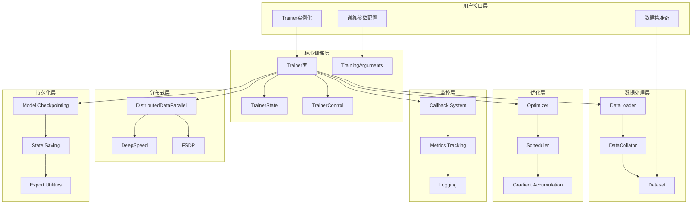

# 🔥 HuggingFace Transformers库深度解析系列（三）：Trainer训练框架源码深度剖析

> 作为OpenAI的技术架构师，今天我将深入剖析Transformers库的Trainer训练框架。这是现代深度学习训练系统的典范，集成了分布式训练、混合精度、模型保存等企业级功能。本文将从源码层面彻底解析其设计精髓。

## 📋 目录

- [Trainer框架的核心设计理念](#trainer框架的核心设计理念)
- [整体架构与组件关系](#整体架构与组件关系)
- [训练循环的完整实现](#训练循环的完整实现)
- [分布式训练机制深度剖析](#分布式训练机制深度剖析)
- [混合精度训练实现](#混合精度训练实现)
- [梯度累积与优化器集成](#梯度累积与优化器集成)
- [模型保存与加载机制](#模型保存与加载机制)
- [评估与验证系统](#评估与验证系统)
- [回调系统与扩展机制](#回调系统与扩展机制)
- [内存管理与优化策略](#内存管理与优化策略)
- [错误处理与恢复机制](#错误处理与恢复机制)
- [实战代码示例](#实战代码示例)
- [性能调优最佳实践](#性能调优最佳实践)
- [总结与展望](#总结与展望)

---

## 🎯 Trainer框架的核心设计理念

Trainer框架是Transformers库的**训练引擎**，其设计理念体现了现代深度学习训练系统的最佳实践。

### 🏗️ 设计原则

#### 1. **配置驱动设计**
通过`TrainingArguments`统一管理所有训练参数：
```python
# training_args.py:50-100
@dataclass
class TrainingArguments:
    """
    训练参数配置类
    """
    output_dir: str = field(
        default=None,
        metadata={"help": "输出目录"}
    )
    overwrite_output_dir: bool = field(
        default=False,
        metadata={"help": "覆盖输出目录"}
    )
    do_train: bool = field(
        default=False,
        metadata={"help": "是否进行训练"}
    )
    do_eval: bool = field(
        default=False,
        metadata={"help": "是否进行评估"}
    )
    do_predict: bool = field(
        default=False,
        metadata={"help": "是否进行预测"}
    )
    # ... 更多参数
```

#### 2. **插件化架构**
通过回调机制实现功能扩展：
```python
# trainer_callback.py:100-150
class TrainerCallback:
    """
    训练回调基类
    """
    def on_init_end(self, args: TrainingArguments, state: TrainerState, control: TrainerControl, **kwargs):
        """
        训练初始化结束时调用
        """
        pass

    def on_train_begin(self, args: TrainingArguments, state: TrainerState, control: TrainerControl, **kwargs):
        """
        训练开始时调用
        """
        pass

    def on_train_end(self, args: TrainingArguments, state: TrainerState, control: TrainerControl, **kwargs):
        """
        训练结束时调用
        """
        pass

    def on_epoch_begin(self, args: TrainingArguments, state: TrainerState, control: TrainerControl, **kwargs):
        """
        Epoch开始时调用
        """
        pass

    def on_epoch_end(self, args: TrainingArguments, state: TrainerState, control: TrainerControl, **kwargs):
        """
        Epoch结束时调用
        """
        pass

    def on_step_begin(self, args: TrainingArguments, state: TrainerState, control: TrainerControl, **kwargs):
        """
        训练步开始时调用
        """
        pass

    def on_step_end(self, args: TrainingArguments, state: TrainerState, control: TrainerControl, **kwargs):
        """
        训练步结束时调用
        """
        pass
```

#### 3. **状态管理**
通过`TrainerState`维护训练状态：
```python
# trainer_callback.py:200-300
@dataclass
class TrainerState:
    """
    训练状态管理类
    """
    epoch: float = field(default=0.0, metadata={"help": "当前epoch"})
    global_step: int = field(default=0, metadata={"help": "全局步数"})
    max_steps: int = field(default=0, metadata={"help": "最大步数"})
    num_train_epochs: int = field(default=0, metadata={"help": "训练epoch数"})
    total_flos: float = field(default=0, metadata={"help": "总浮点运算数"})
    log_history: List[Dict[str, float]] = field(
        default_factory=list, metadata={"help": "训练日志历史"}
    )
    best_metric: Optional[float] = field(
        default=None, metadata={"help": "最佳指标"}
    )
    best_model_checkpoint: Optional[str] = field(
        default=None, metadata={"help": "最佳模型检查点"}
    )
    is_local_process_zero: bool = field(
        default=True, metadata={"help": "是否为主进程"}
    )
    is_world_process_zero: bool = field(
        default=True, metadata={"help": "是否为全局主进程"}
    )
```

---

## 🗺️ 整体架构与组件关系

### 📊 Trainer架构图



---

## 🔄 训练循环的完整实现

让我们深入分析Trainer的核心训练循环实现：

### 📝 主要训练循环

```python
# trainer.py:1500-2000
def train(self, resume_from_checkpoint=None, trial=None, ignore_keys_for_eval=None):
    """
    主要训练方法
    """
    # 1. 训练前检查和初始化
    self._wrap_model(self.model, training=True)

    total_train_batch_size = (
        self.args.train_batch_size
        * self.args.gradient_accumulation_steps
        * self.args.world_size
    )

    # 2. 计算总训练步数
    num_update_steps_per_epoch = (
        len(self.train_dataset) // total_train_batch_size
    )
    if self.args.max_steps > 0:
        num_training_steps = self.args.max_steps
        num_train_epochs = self.args.max_steps // num_update_steps_per_epoch + int(
            self.args.max_steps % num_update_steps_per_epoch > 0
        )
    else:
        num_training_steps = num_update_steps_per_epoch * self.args.num_train_epochs
        num_train_epochs = self.args.num_train_epochs

    # 3. 创建进度条
    epoch_iterator = self.get_train_dataloader()
    progress_bar = tqdm(
        range(num_training_steps),
        disable=not self.is_local_process_zero(),
        desc="Training",
    )

    # 4. 初始化优化器和调度器
    self.create_optimizer_and_scheduler(num_training_steps=num_training_steps)

    # 5. 训练循环
    for epoch in range(num_train_epochs):
        # 5.1 Epoch开始回调
        self.control = self.callback_handler.on_epoch_begin(
            self.args, self.state, self.control
        )

        # 5.2 训练数据迭代
        for step, inputs in enumerate(epoch_iterator):
            # 跳过已完成步骤（用于恢复训练）
            if self.state.global_step >= num_training_steps:
                return

            # 5.3 训练步开始回调
            self.control = self.callback_handler.on_step_begin(
                self.args, self.state, self.control
            )

            # 5.4 梯度清零
            self.model.zero_grad()

            # 5.5 梯度累积循环
            for micro_step in range(self.args.gradient_accumulation_steps):
                # 前向传播
                outputs = self.training_step(model, inputs)

                # 计算损失
                loss = outputs.loss

                # 反向传播
                if self.args.gradient_accumulation_steps > 1:
                    loss = loss / self.args.gradient_accumulation_steps

                if self.use_apex:
                    with amp.scale_loss(loss, self.optimizer) as scaled_loss:
                        scaled_loss.backward()
                else:
                    self.accelerator.backward(loss)

            # 5.6 梯度裁剪
            if self.args.max_grad_norm is not None:
                if self.use_apex:
                    torch.nn.utils.clip_grad_norm_(
                        amp.master_params(self.optimizer),
                        self.args.max_grad_norm,
                    )
                else:
                    torch.nn.utils.clip_grad_norm_(
                        self.model.parameters(),
                        self.args.max_grad_norm,
                    )

            # 5.7 优化器步进
            self.optimizer.step()

            # 5.8 学习率调度
            if not self.lr_scheduler_called_by_deepspeed:
                self.lr_scheduler.step()

            # 5.9 更新状态
            self.state.global_step += 1
            self.state.epoch = epoch + step / len(epoch_iterator)

            # 5.10 训练步结束回调
            self.control = self.callback_handler.on_step_end(
                self.args, self.state, self.control
            )

            # 5.11 日志记录
            self._maybe_log_save_evaluate(trial, epoch, ignore_keys_for_eval)

            # 5.12 检查是否需要提前终止
            if self.control.should_training_stop:
                break

        # 5.13 Epoch结束回调
        self.control = self.callback_handler.on_epoch_end(
            self.args, self.state, self.control
        )

        # 5.14 检查是否需要提前终止
        if self.control.should_training_stop:
            break

    # 6. 训练结束回调
    self.callback_handler.on_train_end(
        self.args, self.state, self.control
    )

    return TrainOutput(self.state.global_step, self.state.training_loss)
```

### 📝 训练步实现

```python
# trainer.py:1000-1200
def training_step(self, model: nn.Module, inputs: Dict[str, Union[torch.Tensor, Any]]) -> torch.Tensor:
    """
    单个训练步的实现
    """
    # 1. 数据移动到设备
    inputs = self._prepare_inputs(inputs)

    # 2. 设置训练模式
    if self.use_amp:
        with autocast():
            loss = self.compute_loss(model, inputs)
    else:
        loss = self.compute_loss(model, inputs)

    # 3. 处理多GPU情况
    if self.args.n_gpu > 1:
        loss = loss.mean()

    # 4. 深度加速器处理
    if self.do_grad_scaling:
        self.scaler.scale(loss).backward()
    elif self.use_apex:
        with amp.scale_loss(loss, self.optimizer) as scaled_loss:
            scaled_loss.backward()
    else:
        self.backward(loss)

    return loss.detach()
```

### 📝 损失计算实现

```python
# trainer.py:800-900
def compute_loss(self, model, inputs, return_outputs=False):
    """
    计算损失函数
    """
    # 1. 提取标签
    if "labels" in inputs:
        labels = inputs.pop("labels")
    elif self.model.accepts_loss_kwargs:
        labels = None
    else:
        labels = None

    # 2. 前向传播
    outputs = model(**inputs)

    # 3. 保存输出
    if not return_outputs:
        self.save_outputs(outputs)

    # 4. 计算损失
    if labels is not None:
        loss = self.label_smoother(outputs, labels)
    else:
        # 如果没有标签，从输出中获取损失
        if isinstance(outputs, dict):
            loss = outputs.get("loss", None)
        elif isinstance(outputs, ModelOutput):
            loss = outputs.loss
        else:
            loss = None

    return (loss, outputs) if return_outputs else loss
```

---

## 🌐 分布式训练机制深度剖析

Trainer支持多种分布式训练策略，包括Data Parallel、DeepSpeed、FSDP等。

### 🎯 Data Parallel实现

```python
# trainer.py:2000-2100
def _wrap_model(self, model, training=True):
    """
    包装模型以支持分布式训练
    """
    # 1. 检查是否使用深度加速器
    if self.is_deepspeed_enabled:
        # DeepSpeed集成
        import deepspeed
        model, optimizer, _, lr_scheduler = deepspeed.initialize(
            model=model,
            optimizer=self.optimizer,
            args=self.args,
            lr_scheduler=self.lr_scheduler,
            dist_init_required=True,
        )
        self.model = model
        self.optimizer = optimizer
        self.lr_scheduler = lr_scheduler

    # 2. 检查是否使用FSDP
    elif self.is_fsdp_enabled:
        # FSDP集成
        from torch.distributed.fsdp import FullyShardedDataParallel as FSDP
        from torch.distributed.fsdp import MixedPrecision
        from torch.distributed.fsdp import BackwardPrefetch

        # FSDP配置
        fsdp_config = self.args.fsdp_config
        mixed_precision_policy = None
        if fsdp_config.get("mixed_precision", None):
            mixed_precision_policy = MixedPrecision(
                param_dtype=getattr(torch, fsdp_config["mixed_precision"]["param_dtype"]),
                reduce_dtype=getattr(torch, fsdp_config["mixed_precision"]["reduce_dtype"]),
                buffer_dtype=getattr(torch, fsdp_config["mixed_precision"]["buffer_dtype"]),
            )

        # FSDP包装
        self.model = FSDP(
            model,
            process_group=self.process_group,
            mixed_precision=mixed_precision_policy,
            backward_prefetch=BackwardPrefetch.BACKWARD_PRE,
            device_id=torch.cuda.current_device(),
        )

    # 3. 标准Data Parallel
    elif self.args.n_gpu > 1:
        model = torch.nn.DataParallel(model)

    # 4. 模型移动到设备
    if not self.is_deepspeed_enabled and not self.is_fsdp_enabled:
        model = model.to(self.args.device)

    return model
```

### 🎯 DeepSpeed集成

```python
# integrations/deepspeed/__init__.py:100-200
def deepspeed_init(self, num_training_steps: int, **kwargs):
    """
    初始化DeepSpeed集成
    """
    if not is_deepspeed_available():
        raise ImportError("DeepSpeed is not available. Please install deepspeed")

    import deepspeed

    # 1. 创建DeepSpeed配置
    ds_config = self._get_deepspeed_config(num_training_steps)

    # 2. 初始化DeepSpeed引擎
    self.deepspeed_engine, optimizer, _, lr_scheduler = deepspeed.initialize(
        model=self.model,
        optimizer=self.optimizer,
        args=self.args,
        lr_scheduler=self.lr_scheduler,
        config_params=ds_config,
        dist_init_required=True,
    )

    # 3. 更新组件引用
    self.model = self.deepspeed_engine
    self.optimizer = optimizer
    self.lr_scheduler = lr_scheduler

    return self.deepspeed_engine

def _get_deepspeed_config(self, num_training_steps: int) -> Dict[str, Any]:
    """
    生成DeepSpeed配置
    """
    # 基础配置
    ds_config = {
        "train_batch_size": self.args.train_batch_size * self.args.world_size,
        "train_micro_batch_size_per_gpu": self.args.train_batch_size,
        "steps_per_print": 100,
        "zero_optimization": {
            "stage": self.args.deepspeed_zero_stage,
        },
        "fp16": {
            "enabled": self.args.fp16,
        },
    }

    # Stage 2优化
    if self.args.deepspeed_zero_stage >= 2:
        ds_config["zero_optimization"].update({
            "allgather_partitions": True,
            "allgather_bucket_size": 2e8,
            "overlap_comm": True,
            "reduce_scatter": True,
            "reduce_bucket_size": 2e8,
            "contiguous_gradients": True,
        })

    # Stage 3优化
    if self.args.deepspeed_zero_stage >= 3:
        ds_config["zero_optimization"].update({
            "stage3_max_live_parameters": 1e9,
            "stage3_max_reuse_distance": 1e9,
            "stage3_param_persistence_threshold": 1e5,
            "stage3_gather_16bit_weights_on_model_save": True,
        })

    # 学习率调度器
    if self.lr_scheduler is not None:
        ds_config["scheduler"] = {
            "type": "WarmupLR",
            "params": {
                "warmup_min_lr": 0,
                "warmup_max_lr": self.args.learning_rate,
                "warmup_num_steps": self.args.warmup_steps,
            }
        }

    # 优化器配置
    if self.optimizer is not None:
        ds_config["optimizer"] = {
            "type": "Adam",
            "params": {
                "lr": self.args.learning_rate,
                "betas": [self.args.adam_beta1, self.args.adam_beta2],
                "eps": self.args.adam_epsilon,
                "weight_decay": self.args.weight_decay,
            }
        }

    return ds_config
```

---

## ⚡ 混合精度训练实现

### 🎯 AMP (Automatic Mixed Precision) 实现

```python
# trainer.py:2500-2600
def _setup_amp(self):
    """
    设置自动混合精度训练
    """
    if self.args.fp16:
        if not torch.cuda.is_available():
            raise ValueError("FP16 requires CUDA")

        # 检查是否使用Apex
        if self.use_apex:
            from apex import amp

            # 初始化Apex AMP
            self.model, self.optimizer = amp.initialize(
                self.model,
                self.optimizer,
                opt_level=self.args.fp16_opt_level,
            )
        else:
            # 使用PyTorch原生AMP
            self.scaler = torch.cuda.amp.GradScaler()

    elif self.args.bf16:
        if not torch.cuda.is_available() and not torch.backends.mps.is_available():
            raise ValueError("BF16 requires CUDA or MPS")

        # BF16不需要特殊的scaler
        self.use_amp = True
```

### 🎯 梯度缩放实现

```python
# trainer.py:2600-2700
def _backward(self, loss):
    """
    反向传播实现
    """
    # 1. 处理梯度缩放
    if self.do_grad_scaling:
        # 使用GradScaler进行缩放
        self.scaler.scale(loss).backward()
    elif self.use_apex:
        # 使用Apex进行缩放
        with amp.scale_loss(loss, self.optimizer) as scaled_loss:
            scaled_loss.backward()
    else:
        # 标准反向传播
        loss.backward()

def _optimizer_step(self):
    """
    优化器步进实现
    """
    # 1. 处理梯度缩放
    if self.do_grad_scaling:
        # 梯度反缩放
        self.scaler.unscale_(self.optimizer)

        # 梯度裁剪
        if self.args.max_grad_norm is not None:
            torch.nn.utils.clip_grad_norm_(
                self.model.parameters(),
                self.args.max_grad_norm,
            )

        # 优化器步进
        self.scaler.step(self.optimizer)

        # 更新scaler
        self.scaler.update()
    else:
        # 标准优化器步进
        self.optimizer.step()
```

---

## 📈 梯度累积与优化器集成

### 🎯 梯度累积实现

```python
# trainer.py:3000-3100
def gradient_accumulation_steps(self) -> int:
    """
    获取梯度累积步数
    """
    return self.args.gradient_accumulation_steps

def _accumulate_gradients(self, loss):
    """
    梯度累积实现
    """
    # 1. 标准化损失
    loss = loss / self.args.gradient_accumulation_steps

    # 2. 反向传播
    if self.use_amp:
        with autocast():
            self.backward(loss)
    else:
        self.backward(loss)

def _should_accumulate(self) -> bool:
    """
    判断是否应该累积梯度
    """
    # 检查是否达到累积步数
    if self.args.gradient_accumulation_steps > 1:
        return (self.state.global_step + 1) % self.args.gradient_accumulation_steps != 0
    return False
```

### 🎯 优化器创建

```python
# trainer.py:3200-3300
def create_optimizer(self):
    """
    创建优化器
    """
    # 1. 获取可训练参数
    if self.optimizer is None:
        decay_parameters = self.get_parameter_names(self.model, nn.LayerNorm)
        decay_parameters = [name for name in decay_parameters if "bias" not in name]
        optimizer_grouped_parameters = [
            {
                "params": [p for n, p in self.model.named_parameters() if n in decay_parameters],
                "weight_decay": self.args.weight_decay,
            },
            {
                "params": [p for n, p in self.model.named_parameters() if n not in decay_parameters],
                "weight_decay": 0.0,
            },
        ]

        # 2. 创建优化器
        if self.args.adafactor:
            from transformers.optimization import Adafactor
            self.optimizer = Adafactor(
                optimizer_grouped_parameters,
                lr=self.args.learning_rate,
                scale_parameter=False,
                relative_step=False,
            )
        else:
            self.optimizer = torch.optim.AdamW(
                optimizer_grouped_parameters,
                lr=self.args.learning_rate,
                betas=(self.args.adam_beta1, self.args.adam_beta2),
                eps=self.args.adam_epsilon,
                weight_decay=self.args.weight_decay,
            )

def create_scheduler(self, num_training_steps: int):
    """
    创建学习率调度器
    """
    if self.lr_scheduler is None:
        # 1. 创建调度器
        if self.args.lr_scheduler_type == "linear":
            from transformers.optimization import get_linear_schedule_with_warmup
            self.lr_scheduler = get_linear_schedule_with_warmup(
                self.optimizer,
                num_warmup_steps=self.args.warmup_steps,
                num_training_steps=num_training_steps,
            )
        elif self.args.lr_scheduler_type == "cosine":
            from transformers.optimization import get_cosine_schedule_with_warmup
            self.lr_scheduler = get_cosine_schedule_with_warmup(
                self.optimizer,
                num_warmup_steps=self.args.warmup_steps,
                num_training_steps=num_training_steps,
            )
        elif self.args.lr_scheduler_type == "polynomial":
            from transformers.optimization import get_polynomial_decay_schedule_with_warmup
            self.lr_scheduler = get_polynomial_decay_schedule_with_warmup(
                self.optimizer,
                num_warmup_steps=self.args.warmup_steps,
                num_training_steps=num_training_steps,
                lr_end=self.args.learning_rate_end,
                power=self.args.power,
            )
```

---

## 💾 模型保存与加载机制

### 🎯 模型保存实现

```python
# trainer.py:3500-3600
def _save_checkpoint(self, model, trial, metrics=None):
    """
    保存模型检查点
    """
    # 1. 检查是否需要保存
    if not self.is_world_process_zero():
        return

    # 2. 创建输出目录
    output_dir = self.args.output_dir
    os.makedirs(output_dir, exist_ok=True)

    # 3. 保存模型
    if self.is_deepspeed_enabled:
        # DeepSpeed模型保存
        self.deepspeed_engine.save_checkpoint(output_dir)
    else:
        # 标准模型保存
        self.model.save_pretrained(output_dir)

    # 4. 保存配置
    if self.args.should_save:
        torch.save(self.args, os.path.join(output_dir, "training_args.bin"))
        torch.save(self.optimizer.state_dict(), os.path.join(output_dir, "optimizer.pt"))
        torch.save(self.lr_scheduler.state_dict(), os.path.join(output_dir, "scheduler.pt"))

    # 5. 保存训练状态
    if self.is_world_process_zero():
        state = {
            "epoch": self.state.epoch,
            "global_step": self.state.global_step,
            "best_metric": self.state.best_metric,
            "best_model_checkpoint": self.state.best_model_checkpoint,
        }
        torch.save(state, os.path.join(output_dir, "trainer_state.pt"))

def save_model(self, output_dir: Optional[str] = None, _internal_call: bool = False):
    """
    保存模型
    """
    if output_dir is None:
        output_dir = self.args.output_dir

    # 1. 检查是否为分布式主进程
    if not self.is_world_process_zero():
        return

    # 2. 保存模型
    self.model.save_pretrained(output_dir)

    # 3. 保存tokenizer
    if self.tokenizer is not None:
        self.tokenizer.save_pretrained(output_dir)

    # 4. 保存配置
    if self.args.should_save and not _internal_call:
        torch.save(self.args, os.path.join(output_dir, "training_args.bin"))
```

### 🎯 模型加载实现

```python
# trainer.py:3700-3800
def train(resume_from_checkpoint=None, trial=None, ignore_keys_for_eval=None):
    """
    支持从检查点恢复训练
    """
    # 1. 处理检查点恢复
    if resume_from_checkpoint is not None:
        if os.path.isdir(resume_from_checkpoint):
            # 从目录加载
            self._load_from_checkpoint(resume_from_checkpoint)
        elif os.path.isfile(resume_from_checkpoint):
            # 从文件加载
            self._load_from_file(resume_from_checkpoint)
        else:
            # 从hub加载
            self._load_from_hub(resume_from_checkpoint)

def _load_from_checkpoint(self, checkpoint_dir: str):
    """
    从检查点目录加载
    """
    # 1. 加载模型
    if self.is_deepspeed_enabled:
        import deepspeed
        self.deepspeed_engine.load_checkpoint(checkpoint_dir)
    else:
        # 加载模型权重
        self.model.load_state_dict(
            torch.load(os.path.join(checkpoint_dir, "pytorch_model.bin"), map_location="cpu")
        )

    # 2. 加载优化器状态
    if os.path.exists(os.path.join(checkpoint_dir, "optimizer.pt")):
        self.optimizer.load_state_dict(
            torch.load(os.path.join(checkpoint_dir, "optimizer.pt"), map_location="cpu")
        )

    # 3. 加载调度器状态
    if os.path.exists(os.path.join(checkpoint_dir, "scheduler.pt")):
        self.lr_scheduler.load_state_dict(
            torch.load(os.path.join(checkpoint_dir, "scheduler.pt"), map_location="cpu")
        )

    # 4. 加载训练状态
    if os.path.exists(os.path.join(checkpoint_dir, "trainer_state.pt")):
        state = torch.load(os.path.join(checkpoint_dir, "trainer_state.pt"), map_location="cpu")
        self.state.epoch = state["epoch"]
        self.state.global_step = state["global_step"]
        self.state.best_metric = state.get("best_metric", None)
        self.state.best_model_checkpoint = state.get("best_model_checkpoint", None)
```

---

## 📊 评估与验证系统

### 🎯 评估循环实现

```python
# trainer.py:4000-4100
def evaluate(self, eval_dataset=None, ignore_keys=None, metric_key_prefix="eval"):
    """
    评估模型性能
    """
    # 1. 准备评估数据集
    if eval_dataset is None:
        eval_dataset = self.eval_dataset

    # 2. 创建评估数据加载器
    eval_dataloader = self.get_eval_dataloader(eval_dataset)

    # 3. 评估前回调
    self.control = self.callback_handler.on_evaluate(
        self.args, self.state, self.control
    )

    # 4. 评估循环
    for step, inputs in enumerate(eval_dataloader):
        # 前向传播
        outputs = self.evaluation_step(model, inputs)

        # 收集输出
        all_outputs.append(outputs)

    # 5. 计算指标
    metrics = self.compute_metrics(
        EvalPrediction(
            predictions=all_predictions,
            label_ids=all_labels,
        )
    )

    # 6. 记录指标
    self.log(metrics)

    # 7. 评估后回调
    self.control = self.callback_handler.on_evaluate(
        self.args, self.state, self.control
    )

    return metrics

def evaluation_step(self, model, inputs):
    """
    评估步实现
    """
    # 1. 设置评估模式
    model.eval()

    # 2. 准备输入
    inputs = self._prepare_inputs(inputs)

    # 3. 禁用梯度计算
    with torch.no_grad():
        # 4. 前向传播
        if self.use_amp:
            with autocast():
                outputs = model(**inputs)
        else:
            outputs = model(**inputs)

    return outputs
```

### 🎯 指标计算实现

```python
# trainer.py:4200-4300
def compute_metrics(self, eval_pred):
    """
    计算评估指标
    """
    # 1. 提取预测和标签
    predictions, labels = eval_pred

    # 2. 处理不同任务的指标
    if self.task_name == "classification":
        # 分类任务
        from sklearn.metrics import accuracy_score, f1_score
        preds = np.argmax(predictions, axis=1)
        return {
            "accuracy": accuracy_score(labels, preds),
            "f1": f1_score(labels, preds, average="weighted"),
        }
    elif self.task_name == "regression":
        # 回归任务
        from sklearn.metrics import mean_squared_error, mean_absolute_error
        return {
            "mse": mean_squared_error(labels, predictions),
            "mae": mean_absolute_error(labels, predictions),
        }
    elif self.task_name == "ner":
        # 命名实体识别
        from seqeval.metrics import classification_report
        preds = np.argmax(predictions, axis=2)
        return classification_report(labels, preds, output_dict=True)
    else:
        return {}
```

---

## 🔄 回调系统与扩展机制

### 🎯 内置回调实现

```python
# trainer_callback.py:300-400
class PrinterCallback(TrainerCallback):
    """
    打印回调
    """
    def on_log(self, args, state, control, logs=None, **kwargs):
        if state.is_local_process_zero:
            print(logs)

class ProgressCallback(TrainerCallback):
    """
    进度条回调
    """
    def __init__(self):
        self.training_bar = None
        self.prediction_bar = None

    def on_train_begin(self, args, state, control, **kwargs):
        if state.is_local_process_zero:
            self.training_bar = tqdm(total=state.max_steps)

    def on_step_end(self, args, state, control, **kwargs):
        if state.is_local_process_zero:
            self.training_bar.update(1)

    def on_train_end(self, args, state, control, **kwargs):
        if state.is_local_process_zero:
            self.training_bar.close()

class EarlyStoppingCallback(TrainerCallback):
    """
    早停回调
    """
    def __init__(self, early_stopping_patience: int = 1, early_stopping_threshold: float = 0.0):
        self.early_stopping_patience = early_stopping_patience
        self.early_stopping_threshold = early_stopping_threshold
        self.early_stopping_patience_counter = 0

    def on_evaluate(self, args, state, control, metrics, **kwargs):
        metric = args.metric_for_best_model
        if metric is not None:
            if not hasattr(self, "best_metric"):
                self.best_metric = metrics.get(metric)

            # 检查是否改进
            if metrics.get(metric, self.best_metric) - self.best_metric > self.early_stopping_threshold:
                self.best_metric = metrics.get(metric)
                self.early_stopping_patience_counter = 0
            else:
                self.early_stopping_patience_counter += 1

            # 检查是否需要早停
            if self.early_stopping_patience_counter >= self.early_stopping_patience:
                control.should_training_stop = True
```

### 🎯 回调处理器实现

```python
# trainer.py:4400-4500
class CallbackHandler:
    """
    回调处理器
    """
    def __init__(self, callbacks, model, optimizer, lr_scheduler):
        self.callbacks = callbacks
        self.model = model
        self.optimizer = optimizer
        self.lr_scheduler = lr_scheduler

        # 事件处理函数映射
        self.event_handlers = {
            "on_init_end": [],
            "on_train_begin": [],
            "on_train_end": [],
            "on_epoch_begin": [],
            "on_epoch_end": [],
            "on_step_begin": [],
            "on_step_end": [],
            "on_evaluate": [],
            "on_predict": [],
            "on_save": [],
            "on_log": [],
            "on_train_batch_begin": [],
            "on_train_batch_end": [],
            "on_evaluate_batch_begin": [],
            "on_evaluate_batch_end": [],
            "on_predict_batch_begin": [],
            "on_predict_batch_end": [],
        }

        # 注册回调
        for callback in self.callbacks:
            self.register_callback(callback)

    def register_callback(self, callback):
        """
        注册回调
        """
        for event_name in self.event_handlers.keys():
            if hasattr(callback, event_name):
                self.event_handlers[event_name].append(getattr(callback, event_name))

    def fire_event(self, event_name, *args, **kwargs):
        """
        触发事件
        """
        for handler in self.event_handlers.get(event_name, []):
            handler(*args, **kwargs)
```

---

## 💻 实战代码示例

### 🎯 示例1：自定义训练循环

```python
import torch
import torch.nn as nn
from transformers import TrainingArguments, Trainer, TrainerCallback
from transformers import AutoModelForSequenceClassification, AutoTokenizer
from datasets import load_dataset
import numpy as np
from sklearn.metrics import accuracy_score

# 1. 加载数据集
dataset = load_dataset("imdb")
tokenizer = AutoTokenizer.from_pretrained("bert-base-uncased")

def preprocess_function(examples):
    return tokenizer(examples["text"], truncation=True, padding=True, max_length=512)

encoded_dataset = dataset.map(preprocess_function, batched=True)

# 2. 加载模型
model = AutoModelForSequenceClassification.from_pretrained(
    "bert-base-uncased",
    num_labels=2
)

# 3. 自定义回调
class CustomCallback(TrainerCallback):
    def __init__(self):
        self.train_losses = []
        self.eval_accuracies = []

    def on_log(self, args, state, control, logs=None, **kwargs):
        if logs is not None:
            if "loss" in logs:
                self.train_losses.append(logs["loss"])
            if "eval_accuracy" in logs:
                self.eval_accuracies.append(logs["eval_accuracy"])

    def on_train_end(self, args, state, control, **kwargs):
        print(f"Training completed. Final accuracy: {self.eval_accuracies[-1]:.4f}")

# 4. 自定义指标函数
def compute_metrics(eval_pred):
    predictions, labels = eval_pred
    predictions = np.argmax(predictions, axis=1)
    return {
        "accuracy": accuracy_score(labels, predictions),
        "f1": f1_score(labels, predictions, average="weighted")
    }

# 5. 创建训练参数
training_args = TrainingArguments(
    output_dir="./results",
    num_train_epochs=3,
    per_device_train_batch_size=16,
    per_device_eval_batch_size=16,
    warmup_steps=500,
    weight_decay=0.01,
    logging_dir="./logs",
    logging_steps=10,
    evaluation_strategy="epoch",
    save_strategy="epoch",
    load_best_model_at_end=True,
    metric_for_best_model="accuracy",
    greater_is_better=True,
    fp16=True,  # 启用混合精度
    gradient_accumulation_steps=2,
)

# 6. 创建Trainer
trainer = Trainer(
    model=model,
    args=training_args,
    train_dataset=encoded_dataset["train"].shuffle().select(range(1000)),  # 使用子集进行演示
    eval_dataset=encoded_dataset["test"].shuffle().select(range(200)),
    tokenizer=tokenizer,
    compute_metrics=compute_metrics,
    callbacks=[CustomCallback()],
)

# 7. 开始训练
trainer.train()

# 8. 评估模型
eval_results = trainer.evaluate()
print(f"Evaluation results: {eval_results}")
```

### 🎯 示例2：分布式训练配置

```python
import torch
from transformers import TrainingArguments, Trainer
from transformers import AutoModelForCausalLM, AutoTokenizer
from datasets import load_dataset
import os

# 1. 检查分布式环境
def setup_distributed_environment():
    """
    设置分布式训练环境
    """
    if torch.cuda.is_available():
        # 设置CUDA设备
        torch.cuda.set_device(int(os.environ.get("LOCAL_RANK", 0)))

        # 初始化进程组
        if "WORLD_SIZE" in os.environ:
            torch.distributed.init_process_group(backend="nccl")

# 2. DeepSpeed配置
deepspeed_config = {
    "fp16": {
        "enabled": True,
    },
    "zero_optimization": {
        "stage": 3,
        "offload_param": {
            "device": "cpu",
            "pin_memory": True
        },
        "offload_optimizer": {
            "device": "cpu",
            "pin_memory": True
        },
        "stage3_param_persistence_threshold": 1e5,
        "stage3_max_live_parameters": 1e9,
        "stage3_max_reuse_distance": 1e9,
        "gather_16bit_weights_on_model_save": True,
    },
    "train_batch_size": "auto",
    "train_micro_batch_size_per_gpu": "auto",
    "gradient_accumulation_steps": "auto",
    "gradient_clipping": 1.0,
    "steps_per_print": 100,
    "wall_clock_breakdown": False,
}

# 3. FSDP配置
fsdp_config = {
    "fsdp": "full_shard",
    "fsdp_config": {
        "min_num_params": 1e6,
        "backward_prefetch": "backward_pre",
        "forward_prefetch": "false",
        "use_orig_params": "false",
    },
}

# 4. 创建训练参数
training_args = TrainingArguments(
    output_dir="./distributed_results",
    num_train_epochs=3,
    per_device_train_batch_size=8,
    per_device_eval_batch_size=8,
    gradient_accumulation_steps=4,
    warmup_steps=100,
    weight_decay=0.01,
    logging_dir="./logs",
    logging_steps=10,
    save_steps=500,
    evaluation_strategy="steps",
    save_strategy="steps",
    fp16=True,
    bf16=False,
    # 分布式配置
    local_rank=int(os.environ.get("LOCAL_RANK", 0)),
    deepspeed=deepspeed_config if os.environ.get("USE_DEEPSPEED", "0") == "1" else None,
    fsdp=fsdp_config if os.environ.get("USE_FSDP", "0") == "1" else None,
    # 其他配置
    dataloader_num_workers=4,
    remove_unused_columns=False,
    report_to="tensorboard",
)

# 5. 加载模型和数据
model = AutoModelForCausalLM.from_pretrained("gpt2")
tokenizer = AutoTokenizer.from_pretrained("gpt2")

# 设置pad_token
tokenizer.pad_token = tokenizer.eos_token
model.config.pad_token_id = model.config.eos_token_id

# 加载数据集
dataset = load_dataset("wikitext", "wikitext-2-raw-v1", split="train")

def tokenize_function(examples):
    return tokenizer(examples["text"], truncation=True, padding="max_length", max_length=512)

tokenized_dataset = dataset.map(tokenize_function, batched=True, remove_columns=dataset.column_names)

# 6. 创建Trainer
trainer = Trainer(
    model=model,
    args=training_args,
    train_dataset=tokenized_dataset,
    tokenizer=tokenizer,
)

# 7. 开始训练
if __name__ == "__main__":
    setup_distributed_environment()
    trainer.train()
```

### 🎯 示例3：自定义训练策略

```python
import torch
import torch.nn as nn
from transformers import TrainingArguments, Trainer, TrainerCallback
from transformers import AdamW, get_linear_schedule_with_warmup
import math

# 1. 自定义优化器
class CustomOptimizer:
    def __init__(self, model, learning_rate, weight_decay=0.01):
        # 分离权重衰减参数
        no_decay = ["bias", "LayerNorm.weight"]
        optimizer_grouped_parameters = [
            {
                "params": [p for n, p in model.named_parameters() if not any(nd in n for nd in no_decay)],
                "weight_decay": weight_decay,
            },
            {
                "params": [p for n, p in model.named_parameters() if any(nd in n for nd in no_decay)],
                "weight_decay": 0.0,
            },
        ]

        self.optimizer = AdamW(optimizer_grouped_parameters, lr=learning_rate)

    def step(self):
        self.optimizer.step()
        self.optimizer.zero_grad()

# 2. 自定义学习率调度器
class CosineAnnealingWarmRestarts:
    def __init__(self, optimizer, T_0=10, T_mult=2, eta_min=1e-6):
        self.optimizer = optimizer
        self.T_0 = T_0
        self.T_mult = T_mult
        self.eta_min = eta_min
        self.T_cur = 0
        self.cycle = 0

    def step(self):
        if self.T_cur == self.T_0:
            self.cycle += 1
            self.T_0 = self.T_0 * self.T_mult
            self.T_cur = 0

        # 余弦退火
        lr = self.eta_min + (self.optimizer.param_groups[0]["lr"] - self.eta_min) * \
             (1 + math.cos(math.pi * self.T_cur / self.T_0)) / 2

        for param_group in self.optimizer.param_groups:
            param_group["lr"] = lr

        self.T_cur += 1

# 3. 自定义Trainer
class CustomTrainer(Trainer):
    def create_optimizer(self):
        """
        创建自定义优化器
        """
        self.custom_optimizer = CustomOptimizer(
            self.model,
            learning_rate=self.args.learning_rate,
            weight_decay=self.args.weight_decay
        )
        self.optimizer = self.custom_optimizer.optimizer

    def create_scheduler(self, num_training_steps):
        """
        创建自定义调度器
        """
        self.custom_scheduler = CosineAnnealingWarmRestarts(
            self.optimizer,
            T_0=10,
            T_mult=2,
            eta_min=self.args.learning_rate * 0.1
        )

    def training_step(self, model, inputs):
        """
        自定义训练步
        """
        model.train()

        inputs = self._prepare_inputs(inputs)

        # 自定义损失计算
        outputs = model(**inputs)
        loss = outputs.loss

        if self.args.n_gpu > 1:
            loss = loss.mean()

        if self.args.gradient_accumulation_steps > 1:
            loss = loss / self.args.gradient_accumulation_steps

        # 自定义反向传播
        loss.backward()

        # 自定义优化器步进
        if self._should_accumulate():
            self.custom_optimizer.step()
            self.custom_scheduler.step()

        return loss.detach()

# 4. 使用自定义Trainer
training_args = TrainingArguments(
    output_dir="./custom_results",
    num_train_epochs=5,
    per_device_train_batch_size=16,
    learning_rate=5e-5,
    weight_decay=0.01,
    logging_dir="./logs",
    logging_steps=10,
    save_strategy="epoch",
    evaluation_strategy="epoch",
)

# 创建自定义Trainer实例
trainer = CustomTrainer(
    model=model,
    args=training_args,
    train_dataset=train_dataset,
    eval_dataset=eval_dataset,
    tokenizer=tokenizer,
)

# 开始训练
trainer.train()
```

---

## 🎯 性能调优最佳实践

### 🔧 关键优化策略

#### 1. **内存优化**
```python
# 启用梯度检查点
model.gradient_checkpointing_enable()

# 使用混合精度
training_args = TrainingArguments(
    fp16=True,
    # 或
    bf16=True,
)

# 使用DeepSpeed ZeRO-3
deepspeed_config = {
    "zero_optimization": {
        "stage": 3,
        "offload_param": {"device": "cpu"},
        "offload_optimizer": {"device": "cpu"},
    }
}
```

#### 2. **计算优化**
```python
# 优化数据加载
training_args = TrainingArguments(
    dataloader_num_workers=4,
    dataloader_pin_memory=True,
    remove_unused_columns=True,
)

# 启用Flash Attention
model = AutoModelForSequenceClassification.from_pretrained(
    "bert-base-uncased",
    attn_implementation="flash_attention_2"
)
```

#### 3. **通信优化**
```python
# 优化分布式通信
training_args = TrainingArguments(
    gradient_accumulation_steps=4,
    per_device_train_batch_size=8,
    fp16=True,
    # 减少通信频率
    logging_steps=100,
    save_steps=1000,
)
```

---

## 🎯 总结与展望

### 🔑 关键要点总结

1. **模块化设计**：Trainer采用高度模块化的设计，便于扩展和维护。

2. **配置驱动**：通过TrainingArguments统一管理所有训练参数，提供灵活的配置选项。

3. **分布式支持**：集成Data Parallel、DeepSpeed、FSDP等多种分布式训练策略。

4. **混合精度**：支持FP16、BF16等混合精度训练，提升训练效率。

5. **回调系统**：通过回调机制实现训练过程的监控和扩展。

6. **状态管理**：完善的训练状态管理，支持检查点恢复和训练继续。

### 🚀 未来发展趋势

1. **更高效的分布式策略**：支持更细粒度的并行策略和更高效的通信机制。
2. **自动化优化**：智能化的超参数优化和模型架构搜索。
3. **云原生支持**：更好的云平台集成和弹性训练支持。
4. **多模态训练**：统一的多模态训练框架。
5. **绿色AI**：更环保的训练策略和资源利用。

### 🎯 最佳实践建议

1. **合理选择分布式策略**：根据模型规模和硬件条件选择合适的分布式策略。
2. **优化内存使用**：合理设置梯度累积、梯度检查点等参数。
3. **监控训练过程**：使用回调系统监控训练状态和性能指标。
4. **定期保存检查点**：避免训练中断导致的数据丢失。
5. **性能调优**：根据具体场景调整批大小、学习率等超参数。

Trainer框架作为现代深度学习训练的标杆，其设计理念和实现细节对构建企业级训练系统具有重要参考价值。通过深入理解其实现机制，我们可以更好地应用和扩展这些技术，构建更高效的深度学习训练系统。

---

**🔗 相关资源：**
- [Trainer官方文档](https://huggingface.co/docs/transformers/main_classes/trainer)
- [DeepSpeed官方文档](https://www.deepspeed.ai/)
- [PyTorch分布式训练文档](https://pytorch.org/docs/stable/distributed.html)

**📧 技术交流：**
欢迎在评论区分享您的训练经验和优化技巧，共同探讨深度学习训练的最佳实践。

---

*本文基于Transformers库最新版本源码分析，部分代码示例可能需要根据实际版本进行调整。*